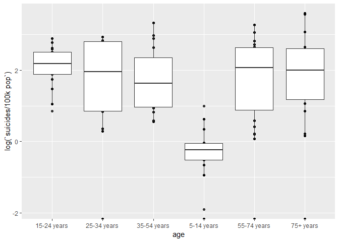
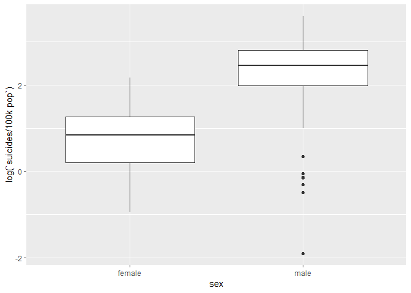

Data Description and EDA
================

Abstract
--------

Data Description
----------------

Research Question
-----------------

What is the effect of different country factors, such as population and gdp, and age of individuals on suicide rate within the past three decades?

Data Import & Cleaning
----------------------

``` r
library(tidyverse)
```

    ## -- Attaching packages --------------------------------------- tidyverse 1.2.1 --

    ## v ggplot2 3.1.0     v purrr   0.2.5
    ## v tibble  2.0.1     v dplyr   0.7.8
    ## v tidyr   0.8.2     v stringr 1.3.1
    ## v readr   1.3.1     v forcats 0.3.0

    ## -- Conflicts ------------------------------------------ tidyverse_conflicts() --
    ## x dplyr::filter() masks stats::filter()
    ## x dplyr::lag()    masks stats::lag()

``` r
(suicide <- read_csv("master.csv", col_names = TRUE, na = "") %>% filter(year >= 2006, country == c("United States", "Canada", "Mexico", "Belize", "Costa Rica", "El Salvador", "Guatemala", "Honduras", "Nicaragua", "Panama")) %>% select(country, year, sex, age, suicides_no, population, 'suicides/100k pop', 'country-year', 'gdp_per_capita ($)', generation))
```

    ## Parsed with column specification:
    ## cols(
    ##   country = col_character(),
    ##   year = col_double(),
    ##   sex = col_character(),
    ##   age = col_character(),
    ##   suicides_no = col_double(),
    ##   population = col_double(),
    ##   `suicides/100k pop` = col_double(),
    ##   `country-year` = col_character(),
    ##   `HDI for year` = col_double(),
    ##   `gdp_for_year ($)` = col_number(),
    ##   `gdp_per_capita ($)` = col_double(),
    ##   generation = col_character()
    ## )

    ## # A tibble: 98 x 10
    ##    country  year sex   age   suicides_no population `suicides/100k ~
    ##    <chr>   <dbl> <chr> <chr>       <dbl>      <dbl>            <dbl>
    ##  1 Belize   2006 male  5-14~           1      37049             2.7 
    ##  2 Belize   2007 fema~ 35-5~           1      28664             3.49
    ##  3 Belize   2008 male  35-5~           6      30511            19.7 
    ##  4 Belize   2008 male  55-7~           0       9580             0   
    ##  5 Belize   2009 fema~ 75+ ~           0       2251             0   
    ##  6 Belize   2010 fema~ 5-14~           0      38304             0   
    ##  7 Belize   2011 male  55-7~           1      11928             8.38
    ##  8 Belize   2012 fema~ 15-2~           2      34680             5.77
    ##  9 Belize   2013 male  25-3~           4      26847            14.9 
    ## 10 Belize   2013 male  75+ ~           0       2335             0   
    ## # ... with 88 more rows, and 3 more variables: `country-year` <chr>,
    ## #   `gdp_per_capita ($)` <dbl>, generation <chr>

``` r
problems(suicide)
```

    ## [1] row      col      expected actual  
    ## <0 rows> (or 0-length row.names)

``` r
mobile <- read_csv("mobile.csv", col_names = TRUE, na = "")
```

    ## Warning: Missing column names filled in: 'X3' [3]

    ## Parsed with column specification:
    ## cols(
    ##   `Data Source` = col_character(),
    ##   `World Development Indicators` = col_character(),
    ##   X3 = col_character()
    ## )

    ## Warning: 265 parsing failures.
    ## row col  expected     actual         file
    ##   2  -- 3 columns 64 columns 'mobile.csv'
    ##   3  -- 3 columns 64 columns 'mobile.csv'
    ##   4  -- 3 columns 64 columns 'mobile.csv'
    ##   5  -- 3 columns 64 columns 'mobile.csv'
    ##   6  -- 3 columns 64 columns 'mobile.csv'
    ## ... ... ......... .......... ............
    ## See problems(...) for more details.

``` r
unemploy <- read_csv("unemployment.csv", col_names = TRUE, na="")
```

    ## Warning: Missing column names filled in: 'X3' [3], 'X4' [4], 'X5' [5],
    ## 'X6' [6], 'X7' [7], 'X8' [8], 'X9' [9], 'X10' [10], 'X11' [11], 'X12' [12],
    ## 'X13' [13], 'X14' [14], 'X15' [15], 'X16' [16], 'X17' [17], 'X18' [18],
    ## 'X19' [19], 'X20' [20], 'X21' [21], 'X22' [22], 'X23' [23], 'X24' [24],
    ## 'X25' [25], 'X26' [26], 'X27' [27], 'X28' [28], 'X29' [29], 'X30' [30],
    ## 'X31' [31], 'X32' [32], 'X33' [33], 'X34' [34], 'X35' [35], 'X36' [36],
    ## 'X37' [37], 'X38' [38], 'X39' [39], 'X40' [40], 'X41' [41], 'X42' [42],
    ## 'X43' [43], 'X44' [44], 'X45' [45], 'X46' [46], 'X47' [47], 'X48' [48],
    ## 'X49' [49], 'X50' [50], 'X51' [51], 'X52' [52], 'X53' [53], 'X54' [54],
    ## 'X55' [55], 'X56' [56], 'X57' [57], 'X58' [58], 'X59' [59], 'X60' [60],
    ## 'X61' [61], 'X62' [62], 'X63' [63]

    ## Parsed with column specification:
    ## cols(
    ##   .default = col_double(),
    ##   `Data Source` = col_character(),
    ##   `World Development Indicators` = col_character(),
    ##   X3 = col_character(),
    ##   X4 = col_character()
    ## )

    ## See spec(...) for full column specifications.

``` r
rural <- read_csv("rural_pop.csv", col_names = TRUE, na = "")
```

    ## Warning: Missing column names filled in: 'X3' [3]

    ## Parsed with column specification:
    ## cols(
    ##   `Data Source` = col_character(),
    ##   `World Development Indicators` = col_character(),
    ##   X3 = col_character()
    ## )

    ## Warning: 265 parsing failures.
    ## row col  expected     actual            file
    ##   2  -- 3 columns 64 columns 'rural_pop.csv'
    ##   3  -- 3 columns 64 columns 'rural_pop.csv'
    ##   4  -- 3 columns 64 columns 'rural_pop.csv'
    ##   5  -- 3 columns 64 columns 'rural_pop.csv'
    ##   6  -- 3 columns 64 columns 'rural_pop.csv'
    ## ... ... ......... .......... ...............
    ## See problems(...) for more details.

``` r
mobile <- mobile %>% gather(key = "year", value = "mobile_per100")

unemploy <- unemploy %>% gather(key = "year", value = "unemployment")

rural <- rural %>% gather(key = "year", value = "rural_pct")


yc <- suicide %>% count(`country-year`, wt = suicides_no)  
colnames(yc)[2] <- "total_suicide"

yc_2 <- suicide %>% count(`country-year`, wt = population)
colnames(yc_2)[2] <- "total_population"

suicide_cy <- left_join(yc, yc_2)
```

    ## Joining, by = "country-year"

``` r
#suicide <- left_join(suicide, suicide_cy)
#suicide <- suicide %>% mutate('total_suicides/100k pop' = total_suicide / total_population * 100000)

#suicide <- merge(suicide, mobile, type = "left", match = "all")
#suicide <- merge(suicide, unemploy, type = "left", match = "all")
#suicide <- merge(suicide, rural, type = "left", match = "all")

#suicide_yc <- suicide %>% group_by(`country-year`) %>% summarize(`gdp_per_capita ($)` = mean(`gdp_per_capita ($)`), total_suicide = mean(total_suicide), total_population = mean(total_population), `total_suicides/100k pop` = mean(`total_suicides/100k pop`), mobile_per100 = mean(mobile_per100), unemployment = mean(unemployment), rural_pct = mean(rural_pct))
```

Variation of Single Variables
-----------------------------

``` r
suicide %>% group_by(age) %>% ggplot(aes(age, log(`suicides/100k pop`))) + geom_point() + geom_boxplot()
```

    ## Warning: Removed 6 rows containing non-finite values (stat_boxplot).



``` r
suicide %>% group_by(country, year) %>% ggplot(aes(sex, log(`suicides/100k pop`))) + geom_boxplot()
```

    ## Warning: Removed 6 rows containing non-finite values (stat_boxplot).



Covariation between Multiple Variables
--------------------------------------

``` r
suicide 
```

    ## # A tibble: 98 x 10
    ##    country  year sex   age   suicides_no population `suicides/100k ~
    ##    <chr>   <dbl> <chr> <chr>       <dbl>      <dbl>            <dbl>
    ##  1 Belize   2006 male  5-14~           1      37049             2.7 
    ##  2 Belize   2007 fema~ 35-5~           1      28664             3.49
    ##  3 Belize   2008 male  35-5~           6      30511            19.7 
    ##  4 Belize   2008 male  55-7~           0       9580             0   
    ##  5 Belize   2009 fema~ 75+ ~           0       2251             0   
    ##  6 Belize   2010 fema~ 5-14~           0      38304             0   
    ##  7 Belize   2011 male  55-7~           1      11928             8.38
    ##  8 Belize   2012 fema~ 15-2~           2      34680             5.77
    ##  9 Belize   2013 male  25-3~           4      26847            14.9 
    ## 10 Belize   2013 male  75+ ~           0       2335             0   
    ## # ... with 88 more rows, and 3 more variables: `country-year` <chr>,
    ## #   `gdp_per_capita ($)` <dbl>, generation <chr>

``` r
suicide %>% group_by(country) %>% ggplot(aes(population,suicides_no)) + 
  geom_point(aes(color = country), position = "jitter") + geom_smooth()
```

    ## `geom_smooth()` using method = 'loess' and formula 'y ~ x'


``` r
suicide %>% group_by(country) %>% ggplot() + 
  geom_boxplot(aes(country, `suicides/100k pop`))
```


``` r
suicide %>% ggplot() + 
  geom_boxplot(aes(factor(year), `suicides/100k pop`))
```


Discussion
----------
